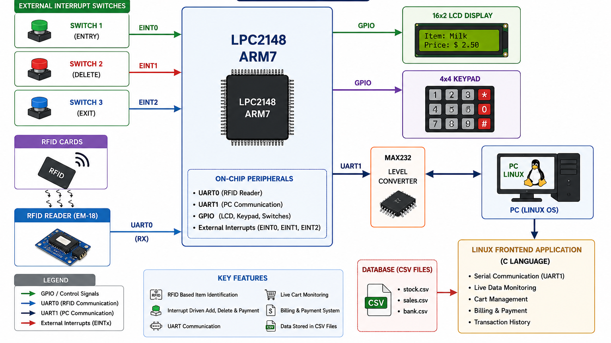
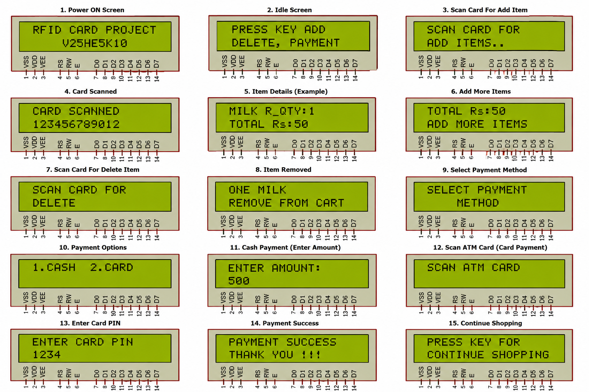

# RFID Smart Cart System using ARM7 LPC2148

## 📖 Project Overview

The **RFID Smart Cart System** is an Embedded System project developed using the **ARM7 LPC2148 Microcontroller** and **Embedded C**. The system automates supermarket billing by identifying products through RFID technology. Customers can add or remove products from the shopping cart using RFID tags, while a Linux-based frontend application performs billing, inventory management, and transaction storage.

The LPC2148 communicates with the RFID Reader using **UART0** and with the Linux application using **UART1**. The Linux application maintains product, sales, and bank information using CSV files and provides a complete billing solution.

---

## Block Daigram


---

# ✨ Features

* RFID-based product identification
* Automatic item addition using RFID cards
* Item removal using dedicated interrupt switch
* Payment initiation through external interrupt
* 16×2 LCD displays item details and total bill
* Linux frontend application developed in C
* UART communication between LPC2148 and Linux PC
* CSV-based database for inventory and billing
* Live shopping cart monitoring
* Transaction history storage
* Menu-driven embedded system operation
* Interrupt-driven user interface
* Real-time billing process

---

# 🔧 Hardware Components

* ARM7 LPC2148 Microcontroller
* EM-18 RFID Reader
* RFID Cards
* 16×2 LCD Display
* 4×4 Matrix Keypad
* Push Buttons (External Interrupt Switches)
* Linux PC
* Crystal Oscillator (12 MHz)
* USB-UART Converter / Serial Cable
* Power Supply
* Connecting Wires

---

## System Architecture



---

# 💻 Software Tools

* Keil uVision IDE
* Embedded C Programming
* Flash Magic
* Linux Operating System
* GCC Compiler
* CSV File Handling
* LPC2148 Peripheral Libraries

---

# 🏗️ System Architecture

The project consists of the following modules.

## 1. RFID Reader Module

* Reads RFID tag information using the EM-18 RFID Reader.
* Communicates with LPC2148 through UART0.
* Sends the unique RFID number whenever a tag is scanned.

---

## 2. ARM7 LPC2148 Controller

Acts as the central processing unit of the system.

### Responsibilities

* Receives RFID data
* Identifies product
* Handles external interrupts
* Updates shopping cart
* Controls LCD
* Communicates with Linux PC through UART1

---

## 3. LCD Display Driver

Displays:

* Product Name
* Product Price
* Quantity
* Total Bill
* Payment Status
* System Messages

---

## 4. Keypad Interface

Used for:
* User authentication (Password)

---

## 5. External Interrupt Module

Three interrupt switches are used.

### EINT0 – Entry Switch

* Adds scanned item to the shopping cart.

### EINT1 – Delete Switch

* Removes the selected item from the shopping cart.

### EINT2 – Payment Switch

* Completes the purchase.
* Sends billing information to the Linux application.

---

## 6. UART Communication Module

### UART0

Communication between:

```
LPC2148 <--> EM-18 RFID Reader
```

### UART1

Communication between:

```
LPC2148 <--> Linux Frontend Application
```

Responsible for:

* Sending product data
* Receiving billing confirmation
* Synchronizing shopping cart information

---

## 7. Linux Frontend Application

Developed using **C Language**.

### Functions

* Receives serial data from LPC2148
* Displays shopping cart
* Calculates total bill
* Updates inventory (By Manager function)
* Stores transaction history
* Generates final bill

---

## 8. Database Module

The Linux application maintains the following CSV files:

```
stock.csv
bank.csv
revenue.csv
```

These files store:

* Product database
* Customer transactions
* Inventory status
* Payment records

---

# ⚙️ Project Methodology


---

## 1. System Initialization

The controller initializes:

* UART0
* UART1
* LCD
* GPIO
* Interrupts (External, UART)
* Keypad

After initialization, the LCD displays the welcome screen "**smart cart RFID**".

---

## 2. Item Addition

The customer presses the **Entry Switch (EINT0)**.

The controller:

* Adds the item to the shopping cart
* Updates quantity
* Displays item information on LCD
* Sends updated cart information to Linux

---

## 3. Item Removal

The customer presses the **Delete Switch (EINT1)**.

The controller:

* Removes the selected item
* Updates total bill
* Sends updated information to Linux

---

## 4. Billing Process

When shopping is completed:

* Customer presses the **Payment Switch (EINT2)**.
* LPC2148 sends complete billing information to the Linux application.

---

## 5. RFID Card Detection

* Customer places an RFID tag near the EM-18 Reader.
* The RFID Reader detects the tag ID.
* The tag ID is transmitted to LPC2148 through UART0.

---

## 6. Product Identification

The LPC2148 compares the received RFID ID with the stored product database.

If the product is valid:

* Product Name is identified.
* Product Price is retrieved.

---

## 7. Live Cart Monitoring

The Linux application continuously receives:

* Product Information
* Quantity
* Price
* Total Bill

The shopping cart remains synchronized with the embedded controller.

---

## 8. Bill Generation

The Linux application:

* Calculates total amount
* Displays final bill
* Updates sales database
* Updates stock database
* Stores transaction details

---

## 9. Payment Confirmation

After successful payment, the LCD displays:

```
PAYMENT SUCCESSFUL
THANK YOU...
```

The transaction is stored in the **revenue.csv** database.

---

## 10. Continuous Operation

The controller clears the shopping cart and waits for the next customer.

---

# 🔄 System Flow



```text
Customer scans RFID Tag
        │
        ▼
Entry/Delete Switch Pressed
        │
        ▼
RFID Reader reads Tag ID
        │
        ▼
UART0 sends data to LPC2148
        │
        ▼
Product Identified
        │
        ▼
Shopping Cart Updated
        │
        ▼
LCD Updated
        │
        ▼
UART1 sends data to Linux
        │
        ▼
Linux Calculates Bill
        │
        ▼
CSV Database Updated
        │
        ▼
Payment Completed
        │
        ▼
Transaction Stored
```

---

# 📡 UART Communication

## UART0

Used for:

```
LPC2148 <--> EM-18 RFID Reader
```

**Baud Rate:** **9600 bps**

---

## UART1

Used for:

```
LPC2148 <--> Linux PC
```

Responsible for:

* Product Information
* Billing Data
* Cart Synchronization

---

# ⚡ Interrupt Usage

| Interrupt | Function    |
| --------- | ----------- |
| EINT0     | Add Item    |
| EINT1     | Remove Item |
| EINT2     | Payment     |

---

# 🛠️ Technical Skills Demonstrated

* Embedded C Programming
* ARM7 LPC2148 Microcontroller
* UART Serial Communication
* GPIO Programming
* External Interrupt Programming
* LCD Driver Development
* RFID Communication
* Linux Serial Programming
* CSV File Handling
* Embedded-Linux Integration
* Real-Time Data Processing
* Shopping Cart Automation
* Interrupt-Driven System Design
* Embedded Application Development

---

# 🚀 Applications

* Automated Supermarket Billing
* Self Checkout System
* Warehouse Product Tracking
* IoT-Based Retail Systems

---

# 📈 Future Enhancements

* QR Code Scanner Integration
* IoT/Wi-Fi Connectivity
* Mobile Application Integration
* Weight Sensor Verification
* Touchscreen Interface
* AI-Based Product Recommendation

---

# 👨‍💻 Author

**Kunal Khond**

Embedded Systems Engineer

* C Programming
* ARM7 LPC2148
* Embedded C
* Linux Programming
* Communication Protocols UART, SPI, I2C, CAN
* RFID-Based Embedded Systems
